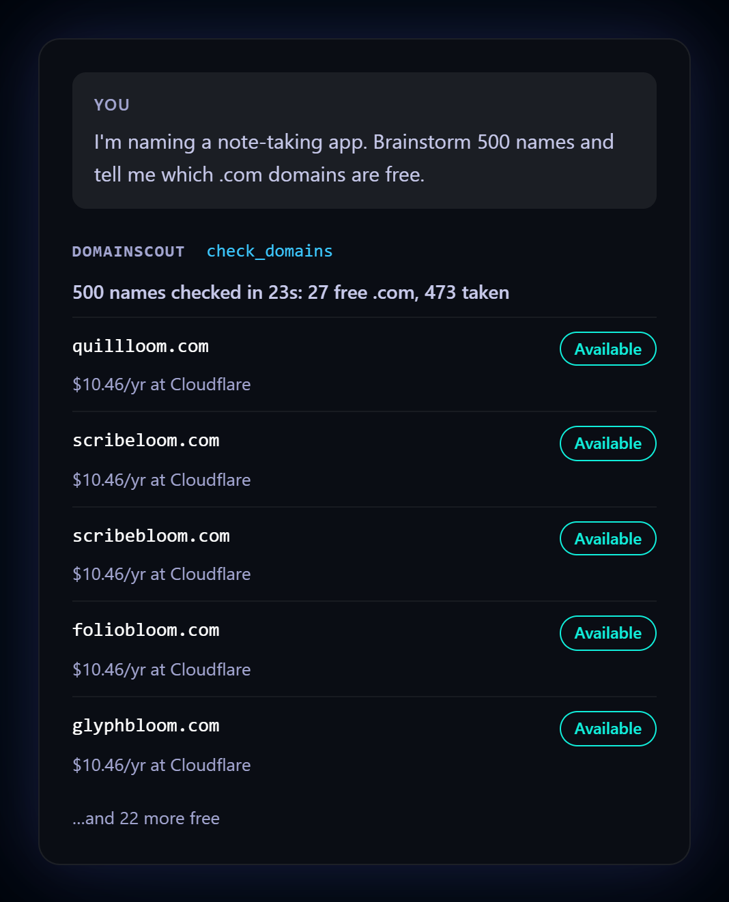
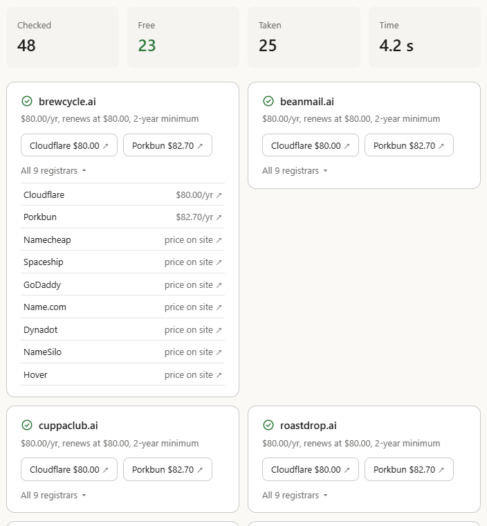

# DomainScout

**Domain research for AI agents.** Every good .com is taken. Find the ones that aren't.

[](https://cursor.com/install-mcp?name=domainscout&config=eyJjb21tYW5kIjoibnB4IiwiYXJncyI6WyIteSIsIkBkYWthaW8vZG9tYWluc2NvdXQtbWNwIl19)
[](https://vscode.dev/redirect/mcp/install?name=domainscout&config=%7B%22command%22%3A%22npx%22%2C%22args%22%3A%5B%22-y%22%2C%22%40dakaio%2Fdomainscout-mcp%22%5D%7D)
[](https://github.com/JohnDaka/domainscout-mcp/releases/latest/download/domainscout.mcpb)
[](https://www.npmjs.com/package/@dakaio/domainscout-mcp)
[](LICENSE)



DomainScout is an MCP server for bulk domain search. Your AI assistant brainstorms hundreds of
names, and DomainScout checks all of them in one call: which are free, what they cost and where
to buy them. It runs on your own machine. You need no account and no server of ours, and API keys
are optional.

[Website](https://domainscout.dakaio.com) ·
[npm](https://www.npmjs.com/package/@dakaio/domainscout-mcp) ·
[MCP Registry](https://registry.modelcontextprotocol.io/v0.1/servers?search=com.dakaio/domainscout) ·
[Examples](examples/README.md)

## What it does

- **Finds the free names in a long list.** Hundreds of names in one call; 500 .com names take
  about 20 seconds.
- **Checks for real.** DNS first, then the registry itself over RDAP, or WHOIS where a TLD has no
  RDAP. A bought but unused domain is still reported as taken.
- **Compares prices at nine registrars:** Cloudflare, Porkbun, Namecheap, Spaceship, GoDaddy,
  Name.com, Dynadot, NameSilo and Hover. The first year, the renewal and any minimum term, cheapest
  to own first.
- **Spots the traps.** Premium and reserved names (with a registrar API key), and taken names that
  are being deleted and may become available soon.
- **Any TLD.** `.com`, `.net` and `.ai` by default; ask for any other.

DomainScout does not invent names: your assistant does that, and DomainScout tells it which of
them are really free.

## Install

Node 20 or newer.

**Claude Desktop:** one click: [download the extension](https://github.com/JohnDaka/domainscout-mcp/releases/latest/download/domainscout.mcpb)
and open it. Claude Desktop asks to install it, and lets you set the options below.

**Claude Code:** the plugin adds the server and a skill that runs the whole name search
(brainstorm, check, present the free names with prices):

```
/plugin marketplace add JohnDaka/domainscout-mcp
/plugin install domainscout@domainscout
```

Or the server alone:

```bash
claude mcp add domainscout -- npx -y @dakaio/domainscout-mcp
```

**Cursor and VS Code:** use the buttons at the top, or add the server to the MCP config.

**Any MCP client:** add to the MCP config:

```json
{
  "mcpServers": {
    "domainscout": {
      "command": "npx",
      "args": ["-y", "@dakaio/domainscout-mcp"],
      "env": { "DOMAINSCOUT_TLDS": "com,net,ai,io" }
    }
  }
}
```

On Windows, if `npx` is not found, use `"command": "cmd"` with
`"args": ["/c", "npx", "-y", "@dakaio/domainscout-mcp"]`.

Then just ask: *"Brainstorm 200 names for my coffee subscription app and tell me which .com
domains are free."*

**From source:** `npm install && npm run build`, then run `node /path/to/domainscout-mcp/dist/index.js`
in place of `npx -y @dakaio/domainscout-mcp`.

## Tools

### `check_domains`

Checks whether domain names are free to register, and shows prices and where to buy the free
ones. Read-only: it never registers or changes anything.

| Parameter | Type | Default | What it is |
|---|---|---|---|
| `domains` | string[] (1 to 1,000 entries) | required | Names or domains: `acme`, `acme.io`, `https://acme.dev`. A name without a TLD is tried in every TLD from `tlds` |
| `tlds` | string[] | `DOMAINSCOUT_TLDS` (`com,net,ai`) | TLDs for names given without one, e.g. `["com"]` for a long list |
| `confirm` | boolean | `true` | Confirm free-looking names with registrar APIs, when you set keys |
| `details` | boolean | `false` | Include the evidence from every source (DNS, RDAP, WHOIS, registrar API) |
| `saved` | string[] | none | Domains the user saved in the results panel: checked again with the rest and marked `saved`, so they stay through a regenerate |

It returns a short text report for the model and the same data as structured content: a summary
with counts per status, one result per domain (status, note, registration dates, buy links with
prices), skipped entries and warnings.

| Status | Meaning |
|---|---|
| `available` | A registrar API confirmed it can be registered; `premium` says whether it costs extra |
| `likely_available` | Not in the registry or DNS, not confirmed by a registrar |
| `taken` | Registered |
| `reserved` | Blocked by the registry, or the registrar cannot sell it |
| `unknown` | Could not verify right now (timeout, rate limit); try again |

## Example

You ask your assistant *"I'm naming a note-taking app. Brainstorm 500 names and tell me which .com
domains are free."* The assistant calls `check_domains` once with all 500 names and gets back:

```text
Checked 500 domain(s) in 23.0s: 27 available, 473 taken.

AVAILABLE (cheapest known offer for each):
- quillloom.com: $10.46/yr at Cloudflare https://www.cloudflare.com/domains/search/?q=quillloom.com
- scribeloom.com: $10.46/yr at Cloudflare https://www.cloudflare.com/domains/search/?q=scribeloom.com
- scribebloom.com: $10.46/yr at Cloudflare https://www.cloudflare.com/domains/search/?q=scribebloom.com
...
TAKEN: quillwise.com, quillnest.com, quillflow.com, quillhub.com, quillpad.com, quillbox.com,
  quillbase.com, quillkit.com, ...
```

Ask about a few favourites afterwards and each one gets every registrar's link and price. More
real output, including the command line and JSON: [examples](examples/README.md).

## Results card

In clients that support [MCP Apps](https://modelcontextprotocol.io/docs/extensions/apps) (Claude on
the web and desktop, VS Code, ChatGPT and others), each `check_domains` call shows an interactive
panel, the same as on [the website](https://domainscout.dakaio.com):

- **The free domains** as a price table (domains down the side, registrars across the top, every
  price a link), a list or cards, in a dark or light theme, switched beside the TLD filter.
  The table sorts by any column; a TLD filter narrows every view to one TLD.
- **Prices** as a range across registrars, with what renewing costs when it differs from the
  first year and what a minimum term costs upfront. Registrars are always in price order,
  cheapest first, the same as in the text report.
- **Every registrar** for a name under "All registrars" or the table's "N more", each a link.
- **Save** the names you like and mark the ones to take after as **Similar**, then **Regenerate**:
  the chat brainstorms a new batch like the marked names (or in the same style, when none are
  marked) that leaves out every name checked so far, and the saved domains come along in the
  new check (the `saved` parameter), still marked as saved and listed first. "Saved 3" beside
  Regenerate asks the chat to compare the saved domains; both buttons explain themselves on hover. "Try other TLDs" re-checks the taken
  names elsewhere, and "Compare in chat" asks the chat to pick one of the saved names; it sees
  what you saved. "Download CSV" saves the free domains with prices and links.

The panel ships in the package (`ui/`), loads nothing from elsewhere, and uses only what the client
offers: a client that can't send messages or save files simply doesn't show those buttons. Other
clients show the text report.



## How it checks

For each domain, in parallel and within polite rate limits:

1. **DNS.** If the TLD zone delegates the name, it is taken. This step is free and saves the
   registries' rate limits.
2. **The registry over RDAP**, the authoritative source. If the domain is found, it is taken;
   the result includes expiry, and a note when the domain is being deleted and may become
   available soon. A 404 means it is likely available.
3. **WHOIS**, only for TLDs without RDAP (for example `.io` and `.de`) or when RDAP fails.
4. **Your registrar API, optional.** If you set an API key, the registrar confirms that each
   free-looking name can really be bought, flags premium names and gives the exact price.

Having no DNS never proves a domain is free: a bought but unused domain has no DNS either.
Without a registrar API key, "not in the registry" is reported as `likely_available`. Premium
and registry-reserved names look the same there, so the registrar's page has the final price.

## Authentication

None. DomainScout works without an account or API keys. Registrar API keys are optional: with
one, free-looking names are confirmed by the registrar, premium names are flagged and the exact
price is shown. One key is enough. With several, the APIs are asked in this order, each name only
until one answers.

| Registrar | Variables | Where to get it |
|---|---|---|
| Name.com | `DOMAINSCOUT_NAMECOM_USERNAME`, `DOMAINSCOUT_NAMECOM_TOKEN` | Account Settings → Security → API Tokens |
| Cloudflare | `DOMAINSCOUT_CLOUDFLARE_ACCOUNT_ID`, `DOMAINSCOUT_CLOUDFLARE_API_TOKEN` | API token with Registrar permission. The Registrar API is in beta |
| Spaceship | `DOMAINSCOUT_SPACESHIP_API_KEY`, `DOMAINSCOUT_SPACESHIP_API_SECRET` | API Manager; the key needs the `domains:read` scope |
| Porkbun | `DOMAINSCOUT_PORKBUN_API_KEY`, `DOMAINSCOUT_PORKBUN_SECRET_KEY` | porkbun.com/account/api |

Each key is sent only to its own registrar's API, and it never appears in output, logs or error
messages. If a registrar rejects a key, the result says so in its notes, and the check still
works without that registrar.

## Settings

Set these as environment variables in the MCP config. All are optional.

| Variable | Default | What it does |
|---|---|---|
| `DOMAINSCOUT_TLDS` | `com,net,ai` | TLDs tried for names given without one |
| `DOMAINSCOUT_REGISTRARS` | all | Registrars to show buy links for, e.g. `cloudflare,porkbun,namecheap` |
| `DOMAINSCOUT_MAX_CONCURRENCY` | `10` | Network requests in flight at once |
| `DOMAINSCOUT_PER_HOST_CONCURRENCY` | `2` | Requests in flight to one RDAP server |
| `DOMAINSCOUT_TIMEOUT_MS` | `10000` | Timeout of one request |
| `DOMAINSCOUT_MAX_DOMAINS` | `500` | Domains per call, after adding TLDs |
| `DOMAINSCOUT_CONFIRM_MAX` | `50` | Free domains per call confirmed through your registrar API |
| `DOMAINSCOUT_DNS` | `on` | DNS pre-check |
| `DOMAINSCOUT_DNS_SERVERS` | system | DNS servers to use, comma-separated |
| `DOMAINSCOUT_PRICES` | `on` | Public price lists |
| `DOMAINSCOUT_AFFILIATE` | `on` | Affiliate buy links (`off` gives plain links) |

## Rate limits

- **Per call:** up to 500 domains after adding TLDs (`DOMAINSCOUT_MAX_DOMAINS`, at most 10,000)
  and 1,000 input entries.
- **Registries:** each RDAP server gets at most 2 requests in flight and 5 per second; each WHOIS
  server one query at a time, at most one per second. A server that answers "too many requests"
  is left alone for as long as it asks, and the request is retried.
- **Registrar APIs:** every API gets its documented limit (Name.com 10 requests per second,
  Cloudflare 4, Spaceship 30 per 30 seconds, Porkbun 8 batches per minute), and at most
  `DOMAINSCOUT_CONFIRM_MAX` names per call are confirmed. Porkbun throttles an account to 50 names
  per 5 minutes for a day once it has checked about 1,800 names in 3 hours while registering few
  of them; the limit keeps every call well below that. A tool call can pass `confirm: false` to
  skip confirmation for a large list.

## Pricing

DomainScout is free and open source under the MIT license. There is no account, subscription or
usage fee. The prices it shows are the registrars' own standard prices, from public price lists,
or the exact price from your registrar API.

## Privacy Policy

The full policy: [domainscout.dakaio.com/privacy.html](https://domainscout.dakaio.com/privacy.html).

- **Data collection:** none. No account, no telemetry, no analytics, and no server of this
  project. We never receive the names you check, your conversations or your API keys.
- **Usage:** to answer a check, your machine sends the domain names, and nothing else, to your
  DNS resolver, the registries (RDAP/WHOIS) and the APIs of the registrars whose keys you set.
  It also downloads IANA's list of registries and two public price lists, the Porkbun price API
  and cfdomainpricing.com (a community mirror of Cloudflare's prices); these get no domain names.
  `DOMAINSCOUT_PRICES=off` turns the price lists off.
- **Storage:** recent answers are cached in memory while the server runs. Nothing is written to
  disk. API keys stay in your MCP client's settings and go only to their own registrar.
- **Third-party sharing:** none by us. The services above see the requests your machine sends
  them. Buy links open the registrar's site, and some are affiliate links (see below).
- **Retention:** nothing is kept after the server stops.
- **Contact:** [GitHub issues](https://github.com/JohnDaka/domainscout-mcp/issues), or the
  [Security tab](https://github.com/JohnDaka/domainscout-mcp/security) for anything private.

## Affiliate links

Some buy links may be affiliate links. When they are, the result says so, and buying through
them earns the project a commission at no extra cost to you. Links are always ordered by price
and never by commission. `DOMAINSCOUT_AFFILIATE=off` turns them off.

## Security

The tool is read-only, runs on your machine, and sends each API key only to its own registrar.
To report a vulnerability, see [SECURITY.md](SECURITY.md).

## Support

- Questions, bugs and ideas: [GitHub issues](https://github.com/JohnDaka/domainscout-mcp/issues)
- Website: [domainscout.dakaio.com](https://domainscout.dakaio.com)

## Command line

```bash
npx @dakaio/domainscout-mcp check acme getacme.io --tlds com,dev
npx @dakaio/domainscout-mcp check acme --json --no-confirm
npx @dakaio/domainscout-mcp check $(cat names.txt) --tlds com
```

## Development

```bash
npm run verify     # typecheck + lint (Biome) + tests with coverage thresholds
npm run build
```

| Path | What it is |
|---|---|
| `src/core/` | The checking funnel, input parsing, shared types, network limits and retries |
| `src/checkers/` | DNS, RDAP and WHOIS lookups |
| `src/confirm/` | Confirmation through registrar APIs, one class per registrar |
| `src/pricing/`, `src/registrars/` | Public price lists, buy links and affiliate templates |
| `src/report/`, `src/messages/` | The text report and every text shown to people or to the model |
| `src/scout/`, `src/server/`, `src/cli/` | The check as a whole, the MCP server and the command line |
| `test/` | Vitest tests; the network is faked, except for a local WHOIS server |
| `examples/` | Real output of the tool |
| `site/` | The landing page at domainscout.dakaio.com: static HTML, put out on every change merged into `main` |
| `server.json`, `manifest.json`, `glama.json` | Listings: the MCP Registry, the Claude Desktop extension, Glama |

Releases happen on merge. A pull request's title says what it is (`feat: …`, `fix: …`,
`docs: …`, `feat!: …`; `.github/workflows/pr-title.yml` checks it), and once it is merged into
`main`, `.github/workflows/publish.yml` decides: `feat` raises the minor version, `fix` and
`perf` the patch version, a `!` or "BREAKING CHANGE" the major one, and anything else, or a
change to nothing the package ships, releases nothing. A release raises the version in
`package.json`, `manifest.json` and `server.json`, adds the merged pull requests to
[CHANGELOG.md](CHANGELOG.md), tags it, publishes to npm (trusted
publishing), creates a GitHub Release with the Claude Desktop extension, publishes to the MCP
Registry and points the Claude plugin at the new version with a lockfile, committing to `main`
as it goes. The landing page goes out on every change to `site/` (`.github/workflows/landing.yml`).

## License

MIT © [dakaio.com](https://dakaio.com)
